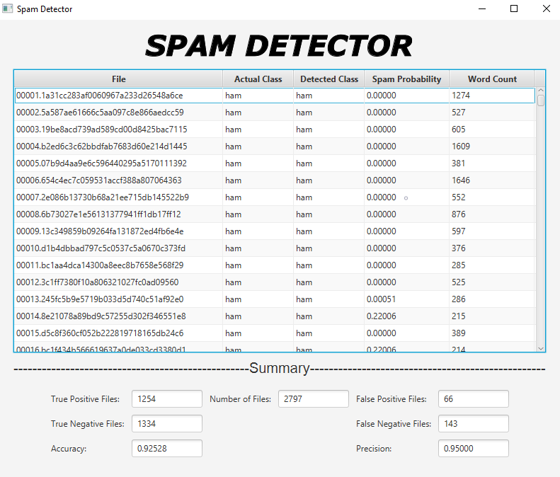

# Spam Emails Detector

## Project Information:

**This project is a spam detector based on the Naive Bayes filtering algorithm. The application has two phases, training and testing.**

-   When started, the user is asked to input two directories. Within each of these two folders, the spam emails are in a `spam` folder, and the ham emails are in a folder called `ham`.
-   In the training phase, the application goes over all of the emails in the train/ham and train/spam folders and computes two word-frequency maps, trainHamFreq, and trainSpamFreq, based on the `Bag-of-words` model. The map trainHamFreq contains a map of words and the number of files containing that word in the ham folder. The map trainSpamFreq contains a map of words and the number of files containing that word in the spam folder. After that, the application computes one more map, containing the probability of each word that appears in a spam file, using the formula derived from `Bayes' theorem`.
-   In the testing phase, the application examines two more folders: test/ham and test/spam. Each file in both directories will be examined, word by word. The ham and spam probabilities for each word in a file will be used to compute a probability that the file is spam, using the formula from the `Naive Bayes filtering` algorithm.
-   Once training and testing have been completed, the application displays the results in a TableView, including columns for the filename (which is unique), the spam probability of the file, and the actual category (which is already known, based on the folder name). At the bottom of the window, there are some summary stats, including the percentage of correct guesses (accuracy) and the ratio of correct positives (spam) to
    spam guesses (correct or not) (precision).

## Improvements:

-   Model: The application also uses the `Laplace smoothing` technique to avoid the zero probability problem in the Naive Bayes algorithm. As a result, the accuracy and precision ratio of the detector increase. I also examined the case sensitivity of the word in the training and testing phases to get higher accuracy and precision.
-   Interface: Title is added at the top. The TableView has two more columns that display the categorization of the file after testing and the number of words in each file. The summary section also has more stats displayed, such as number of correct spam detected files, the number of incorrect spam-detected files, the number of correct ham-detected files, and the number of incorrect ham-detected files.

## How To Run:

1. Clone this repository into your local machine, [instruction](https://docs.github.com/en/github/creating-cloning-and-archiving-repositories/cloning-a-repository)
2. Recommend using IntelliJ IDEA to run the program, [instruction](https://www.jetbrains.com/idea/download/#section=windows)
3. Set up JavaFX environment in IntelliJ IDEA, [instruction for MacOS](https://www.jetbrains.com/help/idea/javafx.html), [instruction for Windows](https://youtu.be/Ope4icw6bVk)
4. Set up data folder structure: check _assignment1_data_modified.rar_ as an example

-   data
    -   train
        -   spam
        -   ham
    -   test
        -   spam
        -   ham

5. Run the program, choose the data folder that you want the program to train and test on

## Other Resources:

[1] [Naive Bayes spam filtering](https://en.wikipedia.org/wiki/Naive_Bayes_spam_filtering)

[2] [Bag-of-words model](https://en.wikipedia.org/wiki/Bag-of-words_model)

[3] [Laplace Smoothing](https://en.wikipedia.org/wiki/Additive_smoothing)
